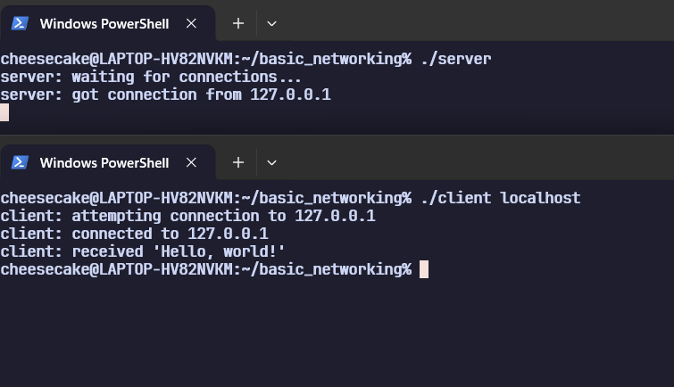
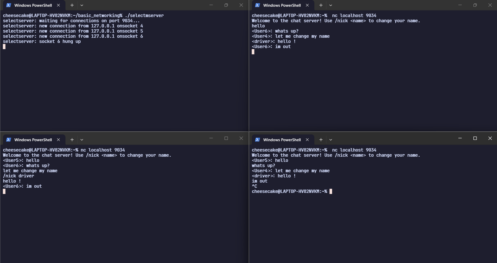

# Unix Networking in C

A completed collection of POSIX networking examples written while working through [Beej's Guide to Network Programming](https://beej.us/guide/bgnet/). The programs stay close to the guide while adding a few experiments, including nickname support in the `select()` chat server.

The repository is a compact reference for learning socket programming in C on Linux or WSL.

## Architecture

```text
.
|-- TCP/
|   |-- server.c                 # Forking TCP greeting server
|   `-- client.c                 # TCP client
|-- UDP/
|   |-- datagramserver.c         # IPv6 UDP listener
|   |-- datagramclient.c         # IPv6 UDP sender
|   `-- broadcaster.c            # IPv4 UDP broadcaster
|-- Multichat Server/
|   |-- multichatserver.c        # Multi-client chat with poll()
|   `-- selectmserver.c          # Multi-client chat with select() and /nick
|-- misc/
|   |-- findip.c                 # Hostname and address lookup
|   |-- pollexample.c            # Minimal poll() example
|   |-- partial_send_handling.c  # Reusable sendall() helper
|   `-- floatdoubleieee.c        # Floating-point packing demonstration
`-- docs/images/                 # Example screenshots
```

Together, the examples cover name resolution, TCP and UDP, IPv4 and IPv6, client/server communication, `fork()`, `select()`, `poll()`, UDP broadcasting, partial sends, and basic data serialization.

## Build

You need a C compiler and standard POSIX networking headers. Netcat is useful for the chat examples.

```bash
sudo apt install build-essential netcat-openbsd

mkdir -p build
cc -Wall -Wextra TCP/server.c -o build/tcp-server
cc -Wall -Wextra TCP/client.c -o build/tcp-client
cc -Wall -Wextra UDP/datagramserver.c -o build/udp-server
cc -Wall -Wextra UDP/datagramclient.c -o build/udp-client
cc -Wall -Wextra UDP/broadcaster.c -o build/udp-broadcaster
cc -Wall -Wextra "Multichat Server/multichatserver.c" -o build/chat-poll
cc -Wall -Wextra "Multichat Server/selectmserver.c" -o build/chat-select
cc -Wall -Wextra misc/findip.c -o build/findip
cc -Wall -Wextra misc/pollexample.c -o build/poll-example
cc -Wall -Wextra misc/floatdoubleieee.c -o build/float-double-ieee
cc -Wall -Wextra -c misc/partial_send_handling.c -o build/partial-send-handling.o
```

`partial_send_handling.c` is a helper without a `main()` function, so it is compiled as an object file.

## Run

### TCP

```bash
# Terminal 1
./build/tcp-server

# Terminal 2
./build/tcp-client localhost
```



### UDP

```bash
# Terminal 1
./build/udp-server

# Terminal 2: unicast
./build/udp-client ::1 "hello over UDP"

# Terminal 2: broadcast
./build/udp-broadcaster 255.255.255.255 "hello everyone"
```

Broadcast delivery depends on the host network, firewall, and WSL configuration.

### Multi-client chat

Run one server, then connect from two or more other terminals:

```bash
./build/chat-poll
# or
./build/chat-select

nc localhost 9034
```

Both servers use port `9034`. The `select()` version also supports `/nick <name>`.



### Utilities

```bash
./build/findip example.com
./build/poll-example
./build/float-double-ieee
```

The floating-point example demonstrates ordinary finite values; it does not implement every IEEE-754 special case.
